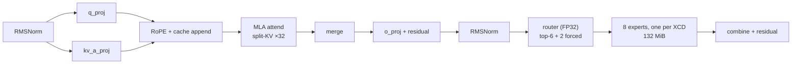

# Fleet-style batch-1 decode for DeepSeek-Coder-V2-Lite on MI300X

Implementing a [Fleet](https://arxiv.org/abs/2604.15379)-style megakernel decode
path for **DeepSeek-Coder-V2-Lite-Base** on a single **AMD Instinct MI300X**.

## The idea

Standard LLM inference runs each operator as its own GPU kernel. For this model
that is roughly **800–1,000 kernel launches per decoded token**, and between
launches the L2 cache is flushed, so every operator reloads its inputs from HBM.

Fleet replaces that with **one persistent kernel** that occupies the whole
device for the entire decode step. Work is expressed as a **task graph resolved
on the GPU**: one workgroup per chiplet acts as a scheduler, the rest are
workers, and dependencies are events in device memory rather than kernel
boundaries. Tasks are scoped to the memory hierarchy — the new level being the
**Chiplet-task**, bound to one XCD's private 4 MB L2.

```
           standard                        Fleet
    ┌──────────────────────┐     ┌────────────────────────────┐
    │ kernel  kernel  ...  │     │  ONE persistent kernel     │
    │   ↓ HBM   ↓ HBM      │     │  scheduler + workers       │
    │ ~800-1000 launches   │     │  on-device task graph      │
    │ L2 flushed each time │     │  ~2,135 tasks, 1 launch    │
    └──────────────────────┘     └────────────────────────────┘
```

## The task

| | |
|---|---|
| Model | DeepSeek-Coder-V2-Lite-Base — 27 layers, MLA attention, 64-expert MoE, 15.7 B total / 2.45 B active |
| Hardware | 1 × MI300X (CDNA 3, `gfx942`, 8 XCDs × 38 CUs, 4 MB L2 each, 192 GB HBM3) |
| Execution | batch-1 autoregressive decode |
| Precision | BF16 initially |
| Input / output | 1,024-token prompt → 32 greedily decoded tokens |
| Excluded | tensor parallelism, continuous batching, speculative decoding, prefill optimization |
| Required milestone | one validated MoE decoder layer at index ≥ 1 — **layer 1** |
| Time limit | 5 days |

Full brief: [`docs/task-description.pdf`](docs/task-description.pdf).

### What makes this model awkward

**MLA** compresses K and V into a 512-wide latent per token, so decode attention
becomes multi-query: 16 query heads against one 576-wide KV "head". **MoE**
routes each token to 6 of 64 experts, chosen by a router that runs *mid-layer* —
so 99 MiB of expert weights are read from addresses not known until the layer is
half done. That is the hardest dependency in the graph.



In the reference the shared-expert branch depends only on the norm. Fleet's
dependency model is a strict chain, so the design does not run it beside the
router; it folds the two shared experts into the routed set as always-selected
experts 64 and 65, which puts exactly one active expert on each of the eight
XCDs ([`docs/design-doc/00-decisions.md`](docs/design-doc/00-decisions.md), D6).

## Status

**Four GPU rounds are done.** Round 1 (2026-09-15) brought the stack up
on the MI300X; round 2 (2026-09-16) reached the required milestone and
the end-to-end decode at 9.6 ms per token; round 3 (2026-09-17,
`docs/gpu-experiments/03-acceleration/`, branch `gpu/round-3`) took the
decode to **4.57 to 4.60 ms per token** on the runtime's event clock
(4.58 to 4.59 by the megakernel's own report), the 32 ids equal to the
reference's, against the 4.5 ms production baseline: the MFMA attention,
the prep task split over the heads, the router, merge and norm loads
batched, the attention as regular tasks, the three boundary fusions. The
round also found that round 2's per-operator table named every gap after
the wrong operator (`07-session-log.md`, finding 1); the remaining time
is in the CK linears (2.7 ms), the boundaries (0.8 ms) and four small
kernels (1.6 ms), `08-results.md`. Round 4 (2026-09-18, `docs/gpu-experiments/04-kernels/`, branch
`gpu/round-4`) went after those three with kernels of our own behind
off-by-default flags and took the decode to **4.26 to 4.34 ms per token**
on the event clock (`FWD_PASS` 4.27 to 4.31), the 32 ids equal, below the
4.5 ms baseline: the batch-1 GEMV linear for qkva, o_proj and the head,
the deeper router, the merge as regular tasks at two halves per head. The
w2 and w13 GEMV forms, the router in four tasks and the merge with o_proj
folded in were measured and are off; the stream probe put the
megakernel's task-shaped reads at 2.25 TB/s, the ceiling the next round
must move (`09-session-log.md`, `10-results.md`). Round 5 (2026-09-18,
`docs/gpu-experiments/05-final/`, branch `gpu/round-5`) is the final and
light stage: no new kernel; the round-4 stack as one flag
(`run_fleet.py --final`), the compare made green by construction (the
route log's tie rule with the gate's softmax weights in the reference,
the iteration-aware boundaries), then one session of 77 minutes on the
round-4 host that produced **4,284 to 4,291 us per token on the event
clock, `FWD_PASS` 4,265, with the ids equal and every compare row green**
(`07-final-numbers.md`, `08-session-log.md`). The knobs and constants
tried at the end of round 4 and in the session's last minutes each lost
on one clock or both, so nothing entered the default; the half-merge
fault was located by halves (MIN-36); the worker-timing hang stayed in
the timing build's buffer form, so its printf reading is out (MIN-35,
open). The balance stands at $0.85 and no session is planned.

| | |
|---|---|
| Documentation | 5 discovery sets (41 files) + the design set (15 files, 1 script) + the five GPU sets under `docs/gpu-experiments/` (the bring-up of 2026-09-15, the validation of 2026-09-16, the acceleration of 2026-09-17 with its log, results and lessons, the kernels prepared on 2026-09-18: the ideas for the GEMV linear and for the router and merge, the two splits, the local preparation, the checklist, the session plan, the rehearsal, its log, results and lessons; the final stage of 2026-09-18: the ideas, the split, the preparation, the checklist, the session plan, the rehearsal, the final numbers and the session log) |
| Local harness | reference run and capture, comparison, weight packing, graph builder, round 3's kernels and round 4's seven (the GEMV linear, the w2 and w13 GEMV forms, the four-task router, the merge as regular tasks and with o_proj folded in, the stream probe) with their runtime glue, all behind off-by-default flags, and round 5's `--final` preset of the winning stack, the route log's tie rule, the iteration-aware boundaries and the head's event count as a flag; environment, session and measurement scripts (`harness/`, `fleet/`, `env/`) |
| Offline gfx942 compile | the patched megakernel headers parse and our kernels compile and link; the cross-XCD fences lower as designed; round 4's union at 256 VGPRs, 171 AGPRs and 8 spills, every call-form kernel's arguments made wave-uniform so no buffer load runs in a waterfall loop; round 5's timing build over the union (`unionT`) compiles with the same scratch, and round 3's launcher tree is disassembled beside round 4's for the merge's standalone regression ([`env/offline_gfx942/`](env/offline_gfx942/README.md)) |
| Next agent | the task is at its final numbers ([`docs/gpu-experiments/05-final/07-final-numbers.md`](docs/gpu-experiments/05-final/07-final-numbers.md)); what remains is off the GPU: MIN-35 (the timing build's hang, next read offline on the `unionT` disassembly) and MIN-36 (the half-merge fault, its next cut named in [`OPEN-PROBLEMS.md`](OPEN-PROBLEMS.md)); the session's tooling notes in [`08-session-log.md`](docs/gpu-experiments/05-final/08-session-log.md); a further round would start from MAJ-8 and the stream ceiling of round 4 |
| Session image | pushed 2026-09-16 as `ghcr.io/golfoscarr/fleet-amd-task:20260916` (25 GB, private) by the `image` stage of round 2; the Dockerfile in [`env/docker/README.md`](env/docker/README.md); the runs of round 2 in [`docs/gpu-experiments/02-validation/03-session-log.md`](docs/gpu-experiments/02-validation/03-session-log.md) and their numbers in [`04-results.md`](docs/gpu-experiments/02-validation/04-results.md) |
| Hardware record | the first hour on the MI300X: 62 checks, the placement offset, the bandwidth band confirmed, the latencies ([`env/hw/20260915/`](env/hw/20260915/summary.md), [`docs/gpu-experiments/01-bringup/`](docs/gpu-experiments/01-bringup/README.md)) |
| Open problems | 5 major open (MAJ-8: the runtime's per-task completion cost, not what bounds the GEMV linears by round 4's grid sweep; MAJ-7 resolved in round 3 as a measurement defect), 18 minor (MIN-35 open: the timing build hangs in the buffer form too; MIN-36 located by halves on the VM, its next cut named), 34 resolved ([`OPEN-PROBLEMS.md`](OPEN-PROBLEMS.md)) |
| Milestone | **M4 reached 2026-09-16**: the 27-layer graph with the head runs 32 iterations and the 32 ids equal the reference's; M2 (layer 1 validated end to end, all 16 boundaries, top-k exact) since 2026-09-15; the fault of round 1 named and fixed in the plan; 12.3 ms per token steady state with the gang linears, 9.6 ms with E2 and per-tile linears (the runtime's event clock; 15.0 and 10.3 ms as host means over 32 iterations) against a 1.15 to 1.35 ms design band ([`PROGRESS.md`](PROGRESS.md), [`docs/gpu-experiments/02-validation/04-results.md`](docs/gpu-experiments/02-validation/04-results.md)) |
| Day-1 question | answered: Fleet builds and runs graphs on this machine (gate 1 PASS, [`env/check_day1.log`](env/check_day1.log)) |

## Key numbers

| | |
|---|---|
| Traffic per token | **4,705.9 MiB** — routed experts 55%, shared experts 18%, `lm_head` 8.5% |
| Roofline | **931 µs** floor at 5.3 TB/s theoretical · **1.15–1.35 ms** at 3.66–4.3 TB/s achievable |
| Rate | 1,074 tok/s floor · **742–871 tok/s** realistic |
| Measured (round 4, 2026-09-18) | **4.26 to 4.34 ms per token, 230 to 235 tok/s** on the runtime's event clock, ids equal ([`docs/gpu-experiments/04-kernels/10-results.md`](docs/gpu-experiments/04-kernels/10-results.md)); round 3: 4.57 to 4.60 ms ([`03-acceleration/08-results.md`](docs/gpu-experiments/03-acceleration/08-results.md)); round 2: 9.6 ms with E2 and per-tile linears ([`02-validation/04-results.md`](docs/gpu-experiments/02-validation/04-results.md)) |
| Layer-1 milestone | 159.6 MiB → 31.6 µs floor / 38.9–45.7 µs realistic |
| Task graph | 12 ops / 68 tasks per MoE layer; 326 ops / 1,880 tasks per token; **3 kernel dispatches per 32-token generation** |
| FP8 (stretch) | 2,571 MiB → 509 µs floor / 627–737 µs realistic — **1.83×** |

## Layout

```
docs/
  design-doc/        the technical design: decisions, execution flow, task
                     graph, synchronization, memory, prefill interface,
                     optimization strategy, correctness, milestones,
                     expected performance, local work
  mi300x/            hardware: architecture, chiplet dispatch, gfx942 memory
                     model, persistent-kernel mechanics, profiling, bandwidth
  deepseek-v2-lite/  model: config, MLA, MoE, per-op tensor flow, weights,
                     roofline, correctness methodology
  fleet/             the approach: paper review, task model, runtime, repo map,
                     sync cross-check, our task graph, gap analysis
  acceleration/      techniques: precision, decode parallelism, kernel craft,
                     and a ledger ranking everything by value
  mla-decode/        the one kernel with no prior art in Fleet: implementation
                     survey and our kernel spec
  gpu-experiments/   the GPU sessions
    01-bringup/      the first sessions (2026-09-15): the hardware record's
                     plan and checklist, every run with its failure and fix,
                     the lessons and ideas, the agent guide
    02-validation/   the second round (2026-09-16): the preparation on the
                     laptop, the two-session plan on a 1x MI300X, its log,
                     results, lessons and the one-page summary (07)
    03-acceleration/ the third round (2026-09-17): the ideas against the
                     4.5 ms target, the laptop and VM split, the local
                     preparation and its checklist, the session plan and
                     the rehearsal, the session log, the results (4.57 to
                     4.60 ms per token) and the lessons with the next round
                     ranked
    04-kernels/      the fourth round (prepared 2026-09-18): the ideas for a
                     batch-1 GEMV linear in place of the CK tile and for the
                     router and the merge, the two splits, the local
                     preparation and its checklist, the session plan and
                     the rehearsal; the VM session pending
  paper/             the Fleet paper
repos/
  fleet-chiplet-megakernel/   ROCm/fleet-chiplet-megakernel (submodule)
```

Each doc set has a `README.md` index, numbered topic files, a
`99-open-questions.md`, and a `sources/` directory holding the primary documents
and scripts its claims derive from.

## Where to start

| If you want | Read |
|---|---|
| The design | [`docs/design-doc/README.md`](docs/design-doc/README.md) |
| The plan and its state | [`PROGRESS.md`](PROGRESS.md) |
| What is still unknown | [`OPEN-PROBLEMS.md`](OPEN-PROBLEMS.md) |
| Why this is hard | [`docs/deepseek-v2-lite/07-roofline.md`](docs/deepseek-v2-lite/07-roofline.md) |
| The correctness hazard | [`docs/mi300x/03-memory-model.md`](docs/mi300x/03-memory-model.md) |
| What we actually build | [`docs/design-doc/02-task-graph.md`](docs/design-doc/02-task-graph.md), kernel spec in [`docs/mla-decode/04-our-kernel-spec.md`](docs/mla-decode/04-our-kernel-spec.md) |
| The task graph | [`docs/design-doc/02-task-graph.md`](docs/design-doc/02-task-graph.md) (supersedes the discovery draft in `docs/fleet/06-our-task-graph.md`) |
| Whether Fleet even helps here | [`docs/fleet/07-gap-analysis.md`](docs/fleet/07-gap-analysis.md) |

## What the analysis established

**Batch-1 decode is memory-bound and little else matters.** Arithmetic intensity
is ~0.5 FLOP/byte, so the 1,307 BF16 TFLOPS are unreachable and only two levers
exist: read fewer bytes, or waste less time not reading.

**Fleet's batch-1 benefit is dispatch overhead, not bandwidth.** Their own
measurements show L2 hit rate moving 16.4% → 16.9% and HBM reads at 0.98× at
batch 1; cooperative weight tiling only activates at batch ≥ 32. We inherit the
task-count collapse, not a traffic reduction — and the design says so rather
than promising a speedup the source paper does not support.

**The eight XCD L2 caches are not coherent.** In the default SPX mode one agent
spans eight private L2s. Cross-XCD visibility needs `buffer_wbl2 sc1` on release
and `buffer_inv sc1` on acquire — and both are documented no-ops on single-L2
parts, so code can appear correct elsewhere and fail here. Confirmed
independently from LLVM's memory model, the CDNA 3 ISA, and Fleet's own source.

**One wave per SIMD is not a ceiling.** A megakernel's register union limits
occupancy to one wave per SIMD, which sounds fatal for a bandwidth-bound
workload. But `VMCNT` is 6 bits, so a single wave can hold 63 loads in flight
and only 2–4 are needed — it becomes a prefetch-depth requirement, not a limit.

**MoE already works in Fleet; MLA does not.** The gap is one kernel, specified
in [`docs/mla-decode/04-our-kernel-spec.md`](docs/mla-decode/04-our-kernel-spec.md).

**The conventional absorbed-MLA advice is wrong at this context length.**
Materializing the fused weights costs +44 MiB/layer to save 8.9 — about 2× worse
than doing nothing at 1,024 tokens. Runtime reassociation gets the cache
reduction for free, which is also what vLLM does.

**FP8 is worth more than everything else combined** — 1.83×, and a quantized
checkpoint exists for this exact model. A stretch goal, since BF16 comes first.

## Method

Every quantitative claim is derived from a primary source and re-derived by
script. Facts carry a verification level — `primary`, `checkpoint`, `derived`,
`secondary`, `machine` — and anything weaker than `primary`/`checkpoint` that
the design depends on is logged as an open problem with the check that settles
it. Defects found in the sources themselves are recorded too, including three
internal contradictions in AMD's partitioning documentation and two incorrect
comments in Fleet's own code.

The parameter count computed from `config.json` alone reproduces the
checkpoint's published `total_size` of 31,412,968,448 bytes **exactly**, which is
the strongest available evidence that the architecture is understood correctly.

```bash
python3 docs/deepseek-v2-lite/sources/roofline.py     # traffic and roofline
python3 docs/acceleration/sources/fp8_roofline.py     # precision scenarios
python3 docs/mi300x/sources/bandwidth_analysis.py     # bandwidth + prefetch depth
```

## Setup and reproducing the result

The number of record (4,284 to 4,291 us per token, `docs/gpu-experiments/05-final/07-final-numbers.md`)
was produced by the commands below on one Hot Aisle 1x MI300X (ROCm 7.2.4, hipcc on the path,
python3 with `venv`, about 50 GB of disk for the checkpoint, the wheels and the builds). Everything the task
built is in this repository: our kernels in `fleet/tasks/mi300/`, the runtime changes as the three
patches in `fleet/patches/`, the upstream megakernel as a submodule pinned at `51dce4f`. The setup
script applies the patches and copies the kernels into the fork; nothing is fetched from anywhere
but the upstream repository and the Hugging Face checkpoint.

```bash
git clone --recursive https://github.com/GolfOscarr/fleet-amd-task.git
cd fleet-amd-task

bash env/session/vm.sh download        # the checkpoint (31 GB, BF16) into the Hugging Face cache, about 2 min
bash env/setup.sh                      # two venvs, the fork patched and built for gfx942 with our kernels, about 8 min
bash env/session/vm.sh preflight       # the toolchain, the venvs, the model and ROCm are in place
bash env/session/vm.sh checks          # 7 machine checks (partition, XCD placement, fences, CU count), about 1.5 min
bash env/session/vm.sh reference       # the PyTorch reference: the boundaries, the 32 ids, the route log with the
                                       # gate's weights, the tolerance calibration; about 1 min
bash env/session/vm.sh kernels nt      # 19 kernel suites at 100 trials each on the streaming build, about 6 min
bash env/session/vm.sh queue env/session/queue-h2.txt   # the finals: the stack at 30, 31 and 32 iterations with the
                                       # compare and the per-operator table, then the FWD_PASS rows; 70 s a row
bash env/session/vm.sh status          # every stage's PASS or FAIL line; the queue's per-row verdicts
```

Each stage runs detached and writes `env/logs/<stage>.out`; `vm.sh check <stage>` prints its status
line. On a fresh machine the first final is about 25 minutes in. One final by hand, without the
queue:

```bash
SNAP=$(ls -d ~/.cache/huggingface/hub/models--deepseek-ai--DeepSeek-Coder-V2-Lite-Base/snapshots/*)
.venv-fleet/bin/python harness/run_fleet.py --layers 27 --head --iters 32 --final --model-dir $SNAP
RUN=harness/fleet_out/L27_head_it32_final_tile_at_fn1_fn2_fs_nt_nts_mfma_rf_w2cktile_gv_lg48_mt_mh2
.venv-fleet/bin/python harness/compare.py --fleet $RUN      # correctness_report.md: the ids, the route log, the boundaries
.venv-fleet/bin/python harness/measure.py --run $RUN        # report_table.md: the per-operator gaps and the median
```

`--final` is the whole stack of round 4 as one flag (the thirteen graph and kernel flags and the
`-DMPK_W2_CK_TILE` define; `harness/run_fleet.py --help` lists them). What to read and what to expect:

| Where | Line | Expected |
|---|---|---|
| `$RUN/report_table.md` | `time per iteration from event timing, median (us)` | 4,284 to 4,291 on the round-4 host; the band of the three iteration counts |
| `$RUN/correctness_report.md` | `Output ids` | `PASS, 32 of 32 matched` at 32 iterations (N of 32 at N iterations) |
| `$RUN/correctness_report.md` | `Route log` | `PASS` by the tie rule with zero disagreements |
| `$RUN/correctness_report.md` | `Overall` | `PASS (7 pass, 0 fail, 0 missing, 1 not comparable, 64 of layers the reference did not capture)` |
| the megakernel's own clock | `[FWD_PASS] iter=N time_ms=...` on stdout of a run with `--iters 29 --no-event-timing` | the median over the 28 lines about 4,265 us |

The event clock and the `FWD_PASS` clock are two readings of the same run shape; the event clock is
the one every number in this repository is quoted on unless marked. The full session that produced
the record, row by row with its minute marks, is `docs/gpu-experiments/05-final/08-session-log.md`;
the laptop-side driver that ran it from a Mac (`env/session/laptop.sh`: push, start, wait, pull) is
described in `docs/gpu-experiments/01-bringup/06-agent-guide.md`.

## Deliverables

| Required by the task | Where |
|---|---|
| Technical design | [`docs/design-doc/`](docs/design-doc/README.md) |
| Source, build and run instructions | `env/setup.sh`, `env/check_day1.sh`, `env/preflight.sh`, [`harness/README.md`](harness/README.md), [`fleet/tasks/README.md`](fleet/tasks/README.md), [`fleet/patches/README.md`](fleet/patches/README.md); the reproduction guide above; the result of record in [`docs/gpu-experiments/05-final/07-final-numbers.md`](docs/gpu-experiments/05-final/07-final-numbers.md) |
| Correctness evidence at every boundary | method in [`docs/deepseek-v2-lite/08-correctness.md`](docs/deepseek-v2-lite/08-correctness.md); the evidence in [`docs/gpu-experiments/02-validation/04-results.md`](docs/gpu-experiments/02-validation/04-results.md) and the reports under `env/hw/20260916/runs/` |
| Profiling commands and results | plan in [`docs/mi300x/06-profiling.md`](docs/mi300x/06-profiling.md); the commands in `env/session/` and the results in [`docs/gpu-experiments/02-validation/04-results.md`](docs/gpu-experiments/02-validation/04-results.md) |
| Milestone reached, remaining fallbacks | [`PROGRESS.md`](PROGRESS.md), [`docs/gpu-experiments/02-validation/07-summary.md`](docs/gpu-experiments/02-validation/07-summary.md) |
| Known failures | [`OPEN-PROBLEMS.md`](OPEN-PROBLEMS.md), [`docs/gpu-experiments/02-validation/06-lessons.md`](docs/gpu-experiments/02-validation/06-lessons.md) |
| Recommended next steps | [`docs/gpu-experiments/02-validation/06-lessons.md`](docs/gpu-experiments/02-validation/06-lessons.md) (measured, in the order of the gain), [`docs/acceleration/04-technique-ledger.md`](docs/acceleration/04-technique-ledger.md) |
