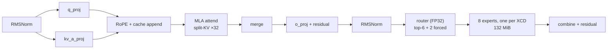

# Fleet-style batch-1 decode for DeepSeek-Coder-V2-Lite on MI300X

Implementing a [Fleet](https://arxiv.org/abs/2604.15379)-style megakernel decode
path for **DeepSeek-Coder-V2-Lite-Base** on a single **AMD Instinct MI300X**.

## The idea

Standard LLM inference runs each operator as its own GPU kernel. For this model
that is roughly **800–1,000 kernel launches per decoded token**, and between
launches the L2 cache is flushed, so every operator reloads its inputs from HBM.

Fleet replaces that with **one persistent kernel** that occupies the whole
device for the entire decode step. Work is expressed as a **task graph resolved
on the GPU**: one workgroup per chiplet acts as a scheduler, the rest are
workers, and dependencies are events in device memory rather than kernel
boundaries. Tasks are scoped to the memory hierarchy — the new level being the
**Chiplet-task**, bound to one XCD's private 4 MB L2.

```
           standard                        Fleet
    ┌──────────────────────┐     ┌────────────────────────────┐
    │ kernel  kernel  ...  │     │  ONE persistent kernel     │
    │   ↓ HBM   ↓ HBM      │     │  scheduler + workers       │
    │ ~800-1000 launches   │     │  on-device task graph      │
    │ L2 flushed each time │     │  ~2,135 tasks, 1 launch    │
    └──────────────────────┘     └────────────────────────────┘
```

## The task

| | |
|---|---|
| Model | DeepSeek-Coder-V2-Lite-Base — 27 layers, MLA attention, 64-expert MoE, 15.7 B total / 2.45 B active |
| Hardware | 1 × MI300X (CDNA 3, `gfx942`, 8 XCDs × 38 CUs, 4 MB L2 each, 192 GB HBM3) |
| Execution | batch-1 autoregressive decode |
| Precision | BF16 initially |
| Input / output | 1,024-token prompt → 32 greedily decoded tokens |
| Excluded | tensor parallelism, continuous batching, speculative decoding, prefill optimization |
| Required milestone | one validated MoE decoder layer at index ≥ 1 — **layer 1** |
| Time limit | 5 days |

Full brief: [`docs/task-description.pdf`](docs/task-description.pdf).

### What makes this model awkward

**MLA** compresses K and V into a 512-wide latent per token, so decode attention
becomes multi-query: 16 query heads against one 576-wide KV "head". **MoE**
routes each token to 6 of 64 experts, chosen by a router that runs *mid-layer* —
so 99 MiB of expert weights are read from addresses not known until the layer is
half done. That is the hardest dependency in the graph.



In the reference the shared-expert branch depends only on the norm. Fleet's
dependency model is a strict chain, so the design does not run it beside the
router; it folds the two shared experts into the routed set as always-selected
experts 64 and 65, which puts exactly one active expert on each of the eight
XCDs ([`docs/design-doc/00-decisions.md`](docs/design-doc/00-decisions.md), D6).

## Status

**Discovery, design and the local harness are complete and reviewed;
the GPU days have not started.** The design is in
[`docs/design-doc/`](docs/design-doc/README.md); everything that runs
without the MI300X is written, tested (66 tests) and, for the GPU code,
compiled for `gfx942` offline with the ROCm 7.0 compiler.

| | |
|---|---|
| Documentation | 5 discovery sets (41 files) + the design set (15 files, 1 script) |
| Local harness | reference run and capture, comparison, weight packing, graph builder, four new kernels and their runtime glue, environment and measurement scripts (`harness/`, `fleet/`, `env/`) |
| Offline gfx942 compile | the patched megakernel headers parse and our kernels compile and link, no spills; the cross-XCD fences lower as designed ([`env/offline_gfx942/`](env/offline_gfx942/README.md)) |
| Next agent | how to reach the GPU and run on the VM: [`docs/gpu-bringup/06-agent-guide.md`](docs/gpu-bringup/06-agent-guide.md); the round-2 plan: [`docs/round-2/`](docs/round-2/README.md) (preparation on the laptop, then two sessions on a 1x MI300X) |
| Session image | Dockerfile and build procedure ready ([`env/docker/README.md`](env/docker/README.md)); not yet pushed, three failed builds documented with their fixes; the next session builds and pushes it first ([`docs/gpu-bringup/05-next-session.md`](docs/gpu-bringup/05-next-session.md)); every run and fix of the first sessions in [`04-session-log.md`](docs/gpu-bringup/04-session-log.md) |
| Hardware record | the first hour on the MI300X: 62 checks, the placement offset, the bandwidth band confirmed, the latencies ([`env/hw/20260915/`](env/hw/20260915/summary.md), [`docs/gpu-bringup/`](docs/gpu-bringup/README.md)) |
| Open problems | 4 major open (three narrowed), 13 minor, 30 resolved ([`OPEN-PROBLEMS.md`](OPEN-PROBLEMS.md)) |
| Milestone | **M2 reached 2026-09-15**: layer 1 validated end to end on the machine, all 16 boundaries, top-k exact; 27 layers run without the head; M4 faults with the head, bisection in progress ([`PROGRESS.md`](PROGRESS.md)) |
| Day-1 question | answered: Fleet builds and runs graphs on this machine (gate 1 PASS, [`env/check_day1.log`](env/check_day1.log)) |

## Key numbers

| | |
|---|---|
| Traffic per token | **4,705.9 MiB** — routed experts 55%, shared experts 18%, `lm_head` 8.5% |
| Roofline | **931 µs** floor at 5.3 TB/s theoretical · **1.15–1.35 ms** at 3.66–4.3 TB/s achievable |
| Rate | 1,074 tok/s floor · **742–871 tok/s** realistic |
| Layer-1 milestone | 159.6 MiB → 31.6 µs floor / 38.9–45.7 µs realistic |
| Task graph | 12 ops / 68 tasks per MoE layer; 326 ops / 1,880 tasks per token; **3 kernel dispatches per 32-token generation** |
| FP8 (stretch) | 2,571 MiB → 509 µs floor / 627–737 µs realistic — **1.83×** |

## Layout

```
docs/
  design-doc/        the technical design: decisions, execution flow, task
                     graph, synchronization, memory, prefill interface,
                     optimization strategy, correctness, milestones,
                     expected performance, local work
  mi300x/            hardware: architecture, chiplet dispatch, gfx942 memory
                     model, persistent-kernel mechanics, profiling, bandwidth
  deepseek-v2-lite/  model: config, MLA, MoE, per-op tensor flow, weights,
                     roofline, correctness methodology
  fleet/             the approach: paper review, task model, runtime, repo map,
                     sync cross-check, our task graph, gap analysis
  acceleration/      techniques: precision, decode parallelism, kernel craft,
                     and a ledger ranking everything by value
  mla-decode/        the one kernel with no prior art in Fleet: implementation
                     survey and our kernel spec
  gpu-bringup/       the GPU sessions: the hardware record's plan and
                     checklist, every run with its failure and fix, the
                     lessons and ideas, the next-session quick start
  round-2/           the second round: the preparation on the laptop,
                     the two-session plan on a 1x MI300X, its log and results
  paper/             the Fleet paper
repos/
  fleet-chiplet-megakernel/   ROCm/fleet-chiplet-megakernel (submodule)
```

Each doc set has a `README.md` index, numbered topic files, a
`99-open-questions.md`, and a `sources/` directory holding the primary documents
and scripts its claims derive from.

## Where to start

| If you want | Read |
|---|---|
| The design | [`docs/design-doc/README.md`](docs/design-doc/README.md) |
| The plan and its state | [`PROGRESS.md`](PROGRESS.md) |
| What is still unknown | [`OPEN-PROBLEMS.md`](OPEN-PROBLEMS.md) |
| Why this is hard | [`docs/deepseek-v2-lite/07-roofline.md`](docs/deepseek-v2-lite/07-roofline.md) |
| The correctness hazard | [`docs/mi300x/03-memory-model.md`](docs/mi300x/03-memory-model.md) |
| What we actually build | [`docs/design-doc/02-task-graph.md`](docs/design-doc/02-task-graph.md), kernel spec in [`docs/mla-decode/04-our-kernel-spec.md`](docs/mla-decode/04-our-kernel-spec.md) |
| The task graph | [`docs/design-doc/02-task-graph.md`](docs/design-doc/02-task-graph.md) (supersedes the discovery draft in `docs/fleet/06-our-task-graph.md`) |
| Whether Fleet even helps here | [`docs/fleet/07-gap-analysis.md`](docs/fleet/07-gap-analysis.md) |

## What the analysis established

**Batch-1 decode is memory-bound and little else matters.** Arithmetic intensity
is ~0.5 FLOP/byte, so the 1,307 BF16 TFLOPS are unreachable and only two levers
exist: read fewer bytes, or waste less time not reading.

**Fleet's batch-1 benefit is dispatch overhead, not bandwidth.** Their own
measurements show L2 hit rate moving 16.4% → 16.9% and HBM reads at 0.98× at
batch 1; cooperative weight tiling only activates at batch ≥ 32. We inherit the
task-count collapse, not a traffic reduction — and the design says so rather
than promising a speedup the source paper does not support.

**The eight XCD L2 caches are not coherent.** In the default SPX mode one agent
spans eight private L2s. Cross-XCD visibility needs `buffer_wbl2 sc1` on release
and `buffer_inv sc1` on acquire — and both are documented no-ops on single-L2
parts, so code can appear correct elsewhere and fail here. Confirmed
independently from LLVM's memory model, the CDNA 3 ISA, and Fleet's own source.

**One wave per SIMD is not a ceiling.** A megakernel's register union limits
occupancy to one wave per SIMD, which sounds fatal for a bandwidth-bound
workload. But `VMCNT` is 6 bits, so a single wave can hold 63 loads in flight
and only 2–4 are needed — it becomes a prefetch-depth requirement, not a limit.

**MoE already works in Fleet; MLA does not.** The gap is one kernel, specified
in [`docs/mla-decode/04-our-kernel-spec.md`](docs/mla-decode/04-our-kernel-spec.md).

**The conventional absorbed-MLA advice is wrong at this context length.**
Materializing the fused weights costs +44 MiB/layer to save 8.9 — about 2× worse
than doing nothing at 1,024 tokens. Runtime reassociation gets the cache
reduction for free, which is also what vLLM does.

**FP8 is worth more than everything else combined** — 1.83×, and a quantized
checkpoint exists for this exact model. A stretch goal, since BF16 comes first.

## Method

Every quantitative claim is derived from a primary source and re-derived by
script. Facts carry a verification level — `primary`, `checkpoint`, `derived`,
`secondary`, `machine` — and anything weaker than `primary`/`checkpoint` that
the design depends on is logged as an open problem with the check that settles
it. Defects found in the sources themselves are recorded too, including three
internal contradictions in AMD's partitioning documentation and two incorrect
comments in Fleet's own code.

The parameter count computed from `config.json` alone reproduces the
checkpoint's published `total_size` of 31,412,968,448 bytes **exactly**, which is
the strongest available evidence that the architecture is understood correctly.

```bash
python3 docs/deepseek-v2-lite/sources/roofline.py     # traffic and roofline
python3 docs/acceleration/sources/fp8_roofline.py     # precision scenarios
python3 docs/mi300x/sources/bandwidth_analysis.py     # bandwidth + prefetch depth
```

## Setup

```bash
git clone --recursive https://github.com/GolfOscarr/fleet-amd-task.git
```

The submodule pins `ROCm/fleet-chiplet-megakernel` at `51dce4f`. It targets
`gfx950` (MI350) by default; building for MI300X needs `AMDGPU_TARGETS=gfx942`,
which is untested and is the day-1 blocking question. Model weights (31 GB BF16)
are not tracked here — download them on the target machine.

## Deliverables

| Required by the task | Where |
|---|---|
| Technical design | [`docs/design-doc/`](docs/design-doc/README.md) |
| Source, build and run instructions | `env/setup.sh`, `env/check_day1.sh`, `env/preflight.sh`, [`harness/README.md`](harness/README.md), [`fleet/tasks/README.md`](fleet/tasks/README.md), [`fleet/patches/README.md`](fleet/patches/README.md); results pending GPU access |
| Correctness evidence at every boundary | method in [`docs/deepseek-v2-lite/08-correctness.md`](docs/deepseek-v2-lite/08-correctness.md) |
| Profiling commands and results | plan in [`docs/mi300x/06-profiling.md`](docs/mi300x/06-profiling.md) |
| Milestone reached, remaining fallbacks | [`PROGRESS.md`](PROGRESS.md) |
| Known failures | [`OPEN-PROBLEMS.md`](OPEN-PROBLEMS.md) |
| Recommended next steps | [`docs/acceleration/04-technique-ledger.md`](docs/acceleration/04-technique-ledger.md) |
